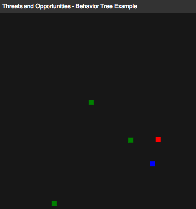

##Component Orchestration with Behavior Trees



### Tree Definition

```

                    new b3.Sequence({
                        children: [
                            new b3.Priority({
                                children: [
                                    new b3.Sequence({
                                        children: [
                                            new ThreatDetected(),
                                            new AvoidThreat()
                                        ]
                                    }),
                                    new b3.Sequence({
                                        children: [
                                            new SeekOpportunity(),
                                            new TakeOpportunity()
                                        ]
                                    })]
                            }),
                            new SeekSubject()]
                    });
```

###References

[https://github.com/andoco/objc-behaviortree](https://github.com/andoco/objc-behaviortree)

[https://github.com/renatopp/behavior3js](https://github.com/renatopp/behavior3js)